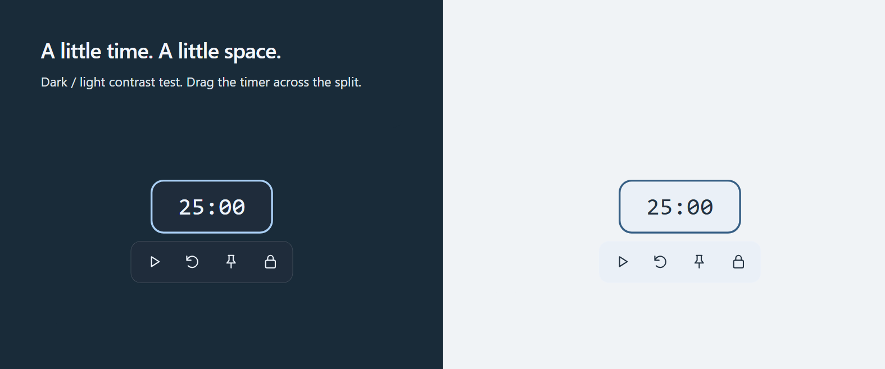

# Glass Timer

A minimal Windows countdown timer with a transparent background, adaptive color
themes, always-on-top pinning, and click-through mode.

## Download and run

1. Open the [latest release](https://github.com/chaoszh/glass-timer/releases/tag/latest).
2. Under **Assets**, download **GlassTimer.exe**—not the source-code archives.
3. Run the downloaded executable.

No installer or separate .NET installation is required. Only the EXE is needed;
its bundled runtime libraries are extracted automatically.

**Requirements:** Windows 10 version 2004 or later, or Windows 11, on an x64 PC.

## Use the timer

The timer starts stopped at **25 minutes**. Hover over it to reveal the controls.
The border shrinks as time runs out.

| Action | How |
|---|---|
| Set the duration | While stopped and unlocked, scroll over the timer. Up adds one minute; down subtracts one minute (1–180). |
| Start, pause, or resume | Click the play/pause control, or double-click the timer. |
| Reset | Click the reset arrow to return to the initial duration. A running timer keeps running. |
| Move | Drag the unlocked timer to your preferred position. |
| Pin | Click the pin control to keep the timer above other windows. Click again to unpin. |
| Lock | Click the lock control. The timer stays on top and mouse clicks pass through to the app underneath. |
| Unlock or bring forward | Left-click the timer icon in the Windows system tray. This unlocks the timer without changing its Pin setting. |
| Change colors | Right-click the timer to preview themes on hover and select one, or right-click the tray icon and choose **Color theme**. |
| Adaptive color and capture | In the tray menu, toggle **Adaptive color**. Off freezes the current contrast and allows screenshots to capture the timer. |
| Quit | Right-click the tray icon and choose **Quit**. |

Glass Timer has **no taskbar button**. If you cannot find its tray icon, check the
notification area's hidden-icons menu.

## Appearance

Choose **Slate, Mint, Amber, Lavender, or Rose**. Each theme adapts its digits and
border to light or dark backgrounds.

At rest, the timer face has a 24% theme-tinted background. Hover deepens it to
80% opacity and reveals the controls. Locked mode keeps the subtle tint while
remaining click-through. Right-click the timer to preview theme colors before selecting.
There are no hover tooltips or shadows.

## Saved settings and notifications

The app remembers your initial duration, position, theme, Pin setting, and lock
state. It starts stopped each time you launch it; an active countdown is not
restored.

Settings are stored locally in `%LOCALAPPDATA%\GlassTimer\settings.json`.
When time runs out, the app sends a Windows notification. Windows notification
settings and Do Not Disturb may prevent it from appearing.

## Screen capture and privacy

When **Adaptive color** is on, automatic contrast samples the small screen area
behind the timer. Samples stay in memory and are **never saved or transmitted**.

To avoid sampling its own digits, the timer is excluded from screen capture while
adaptive color is on. Turn it off in the tray menu to allow the timer to appear
in screenshots, recordings, and screen sharing.

## Updating

Quit the running app from its tray menu, then replace your EXE with the one from
the [latest release](https://github.com/chaoszh/glass-timer/releases/tag/latest).
Your saved settings are kept.

For building from source, see the [developer instructions](GlassTimer/README.md).
